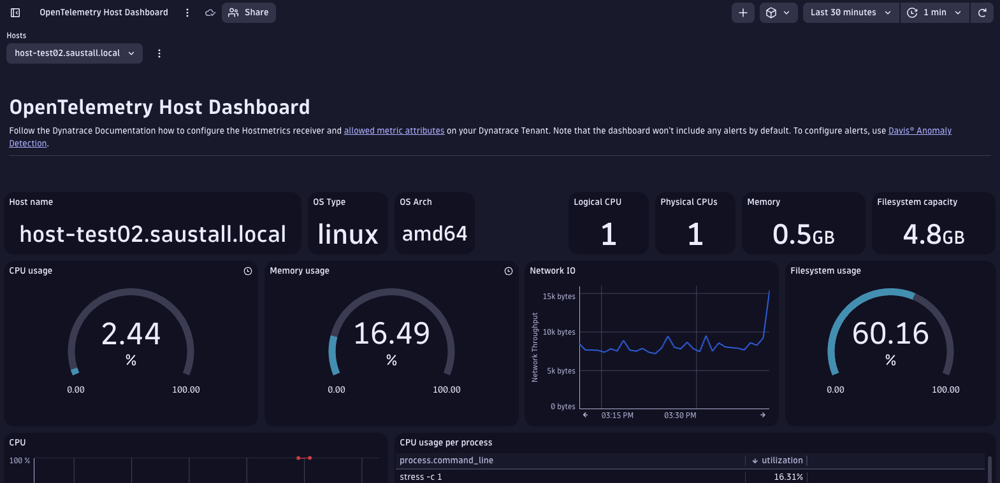

# OpenTelemetry Host Dashboard

> [!WARNING]
> The dashboards shared in this repository are in an alpha state and can change significantly.
> They are provided as-is, with no support guarantees.
> Newer versions of these dashboards could look significantly different from earlier versions and add or remove certain
> metrics.

This folder contains a dashboard that can be used to monitor hosts based on metrics ingested via OpenTelemetry
collectors using the `hostmetrics` receiver and `resourcedetection` processor. The dashboard is in JSON format and can
be uploaded to your Dynatrace tenant
by [following the steps in the Dynatrace documentation](https://docs.dynatrace.com/docs/shortlink/dashboards-use#dashboards-upload).

## Prerequisites

Dynatrace accepts metrics data with delta temporality via OTLP/HTTP.
Collector and Collector Contrib versions v0.107.0 and above as well as Dynatrace Collector versions v0.12.0 and above
support exporting metrics data in that format.

## Collector Configuration

Add the receivers and processors from [hostmetrics configuration example](../../config_examples/host-metrics.yaml) to your OpenTelemetry Collector configuration file to enable the
collection of host metrics with the required attributes, resource detection, and cumulative to delta conversion.
Make sure to also add the receivers and processors to your collector pipeline.
