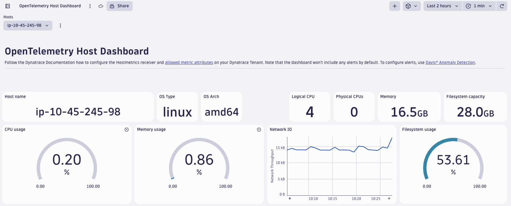

# OpenTelemetry Host Dashboard

> [!WARNING]
> The dashboards shared in this repository are in an alpha state and can change significantly.
> They are provided as-is, with no support guarantees.
> Newer versions of these dashboards could look significantly different from earlier versions and add or remove certain
> metrics.

This folder contains a dashboard that can be used to monitor hosts based on metrics ingested via OpenTelemetry
collectors using the `hostmetrics` receiver and `resourcedetection` processor. The dashboard is in JSON format and can
be uploaded to your Dynatrace tenant
by [following the steps in the Dynatrace documentation](https://docs.dynatrace.com/docs/shortlink/dashboards-use#dashboards-upload).



## Prerequisites

Dynatrace accepts metrics data with delta temporality via OTLP/HTTP.
Collector and Collector Contrib versions v0.107.0 and above as well as Dynatrace Collector versions v0.12.0 and above
support exporting metrics data in that format.

## Collector Configuration

Add the following receiver and processor configuration to your OpenTelemetry Collector configuration file to enable the
collection of host metrics with the required attributes, resource detection, and cumulative to delta conversion.
Make sure to also add the receivers and processors to your collector pipeline.

```yaml
receivers:
  hostmetrics:
    collection_interval: 10s
    scrapers:
      paging:
        metrics:
          system.paging.utilization:
            enabled: true
      cpu:
        metrics:
          system.cpu.logical.count:
            enabled: true
          system.cpu.physical.count:
            enabled: true
          system.cpu.utilization:
            enabled: true
      disk:
      filesystem:
        metrics:
          system.filesystem.utilization:
            enabled: true
      load:
        cpu_average: true
      memory:
        metrics:
          system.memory.limit:
            enabled: true
          system.memory.utilization:
            enabled: true
      network:
      processes:
      process:
        mute_process_all_errors: true
        metrics:
          process.cpu.utilization:
            enabled: true
          process.memory.utilization:
            enabled: true
      system:

processors:
  cumulativetodelta:
  resourcedetection:
    detectors: ["system"]
    system:
      resource_attributes:
        host.arch:
          enabled: true
        host.ip:
          enabled: true

service:
  pipelines:
    metrics:
      receivers: [hostmetrics]
      processors: [resourcedetection, cumulativetodelta]
```

### Adding attributes to the allow list

The following attributes are not included in the default allow list of resource attributes in Dynatrace:

- `host.arch`
- `host.ip`
- `host.name`
- `os.type`
- `process.command_line`
- `process.name`
- `process.pid`
    - CAUTION: This resource attribute only needs to be added when you have processes that spawn sub-processes to be
      able to accurately show CPU/memory usage per process. Only add the `process.pid` attribute if you have a need for it. Adding the attribute can lead to a cardinality explosion in your metrics.
- `mountpoint`
- `device`
- `state`

Follow [this guide](https://docs.dynatrace.com/docs/shortlink/metrics-configuration#allow-list) and add the attributes
above to the allow list.
Note, that the attribute are case-sensitive.
This will ensure that these resource attributes are stored as dimensions on the metrics in Dynatrace.
