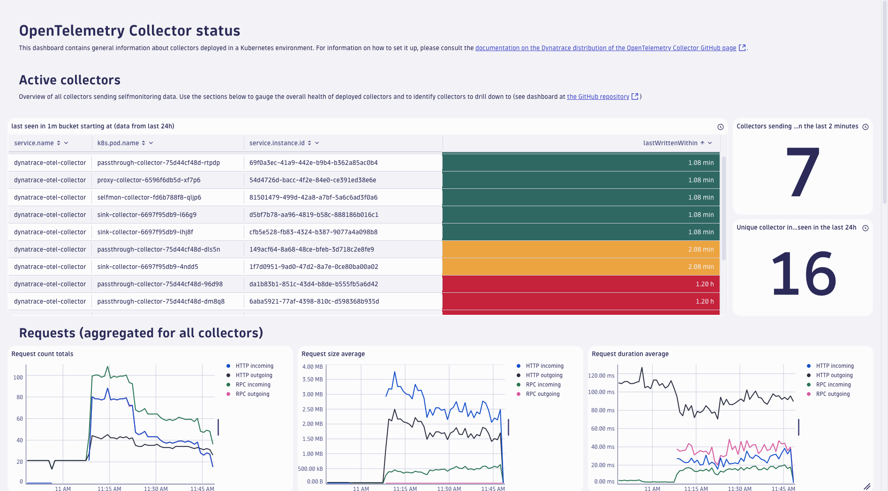
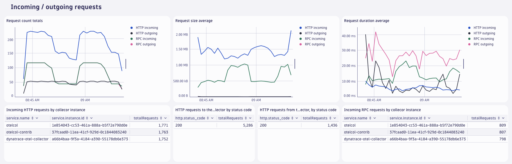
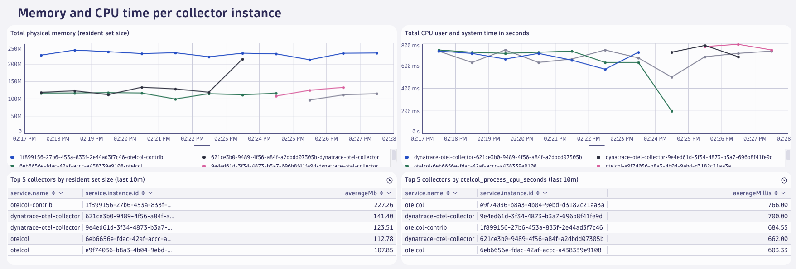

# OpenTelemetry collector self-monitoring dashboards

> [!WARNING]
> The dashboards shared in this repository are in an alpha state and can change significantly.
> They are provided as-is, with no support guarantees. 
> Newer versions of these dashboards could look significantly different from earlier versions and add or remove certain metrics.

This folder contains dashboards that can be used to monitor the health of deployed OpenTelemetry collectors. The dashboards are in JSON format and can be uploaded to your Dynatrace tenant by [following the steps in the Dynatrace documentation](https://docs.dynatrace.com/docs/observe-and-explore/dashboards-and-notebooks/dashboards-new/get-started/dashboards-manage#dashboards-upload).



There are two dashboards:
- [OTel Collector self-monitoring (all collectors)](./OTel%20Collector%20self-monitoring%20(all%20collectors).json) - shows an overview of all detected OpenTelemetry collectors
- [OTel Collector self-monitoring (single collector)](./OTel%20Collector%20self-monitoring%20(single%20collector).json) - allows to look at one specific collector instance. 

The dashboards rely on the presence of the `service.instance.id` resource attribute.
This attribute is added automatically by the collector to all exported telemetry.
However, it is not ingested into Dynatrace by default.
To find out how to add it, please see [Adding `service.instance.id` to the allow list](#adding-serviceinstanceid-to-the-allow-list)

The dashboards use metrics from the collectors' [internal telemetry](https://opentelemetry.io/docs/collector/internal-telemetry/).
See the [list of internal metrics](https://opentelemetry.io/docs/collector/internal-telemetry/#lists-of-internal-metrics) for an overview of which metrics are available.

## Prerequisites
The dashboards rely on the self-monitoring capabilities of the OTel collector as well as certain attributes on the exported metrics data.
Required attributes are: 
- `service.name` (automatically added by the collector and added to data ingested by Dynatrace)
- `service.instance.id` (automatically added by the collector, needs to be [added to the Dynatrace attribute allow list](#adding-serviceinstanceid-to-the-allow-list))

Dynatrace accepts metrics data with Delta temporality via OTLP/HTTP.
Collector and Collector Contrib versions 0.107.0 and above as well as Dynatrace collector versions 0.12.0 and above support exporting metrics data in that format.
Earlier versions ignore the `temporality_preference` flag and would, therefore, require additional processing (cumulative to delta conversion) before ingestion.
It is possible to to this conversion in a collector, but would make the setup more complicated, so it is initially omitted in this document.

The dashboards only use metrics that have a `service.name` from this list: `dynatrace-otel-collector,otelcorecol,otelcontribcol,otelcol,otelcol-contrib`.
At the top of the dashboards, you can filter for specific `service.name`s.
You can also edit the variable and add service names if your collector has a different `service.name` and does therefore not show up on the dash.

### Adding `service.instance.id` to the allow list
While `service.name` is on the Dynatrace OTLP metrics ingest allow list by default, `service.instance.id` is not.
To add it, follow [this guide](https://docs.dynatrace.com/docs/shortlink/metrics-configuration#allow-list) and add `service.instance.id` (case-sensitive) to the list.
This will ensure that this resource attribute is stored as a dimension on the metrics in Dynatrace.
The dashboard will indicate that `service.instance.id` is not set up correctly at the top of the dashboard:


## Sending internal telemetry (self-monitoring data) to Dynatrace
Every OpenTelemetry collector has self-monitoring capabilities, but they need to be activated.
Self-monitoring data can be exported from the collector via the OTLP protocol.
The configuration below assumes the environment variables `DT_ENDPOINT` and `DT_API_TOKEN` to be set.
In order to send data to Dynatrace via OTLP, you will need to supply a Dynatrace endpoint and an ingest token with the `metrics.ingest` scope set.
See the [Dynatrace docs](https://docs.dynatrace.com/docs/extend-dynatrace/opentelemetry/getting-started/otlp-export) for more information.
The `DT_ENDPOINT` environment variable should contain the base url and the base `/api/v2/otlp` (e.g. `https://{your-environment-id}.live.dynatrace.com/api/v2/otlp`).

To send self-monitoring data to Dynatrace, use the following configuration:

```yaml
service:
  # turn on selfmon
  telemetry:
    metrics:
      # metrics verbosity level. Higher verbosity means more metrics. 
      # The dashboard relies on metrics at level detailed.
      level: detailed
      # set up OTLP exporter
      readers:
        - periodic:
            interval: 60000
            exporter:
              otlp:
                protocol: http/protobuf
                temporality_preference: delta
                endpoint: "${env:DT_ENDPOINT}/v1/metrics"
                headers:
                  Authorization: "Api-Token ${env:DT_API_TOKEN}"
```

Note that the OTel collector can automatically merge configuration files for you, so by assuming the above configuration is stored in a file called `selfmon-config.yaml`, it is possible to start the collector like this:

```sh
./dynatrace-otel-collector --config=your-already-existing-config.yaml --config=selfmon-config.yaml
```

Of course, you can also add the configuration directly to your existing collector configuration.

## More screenshots




