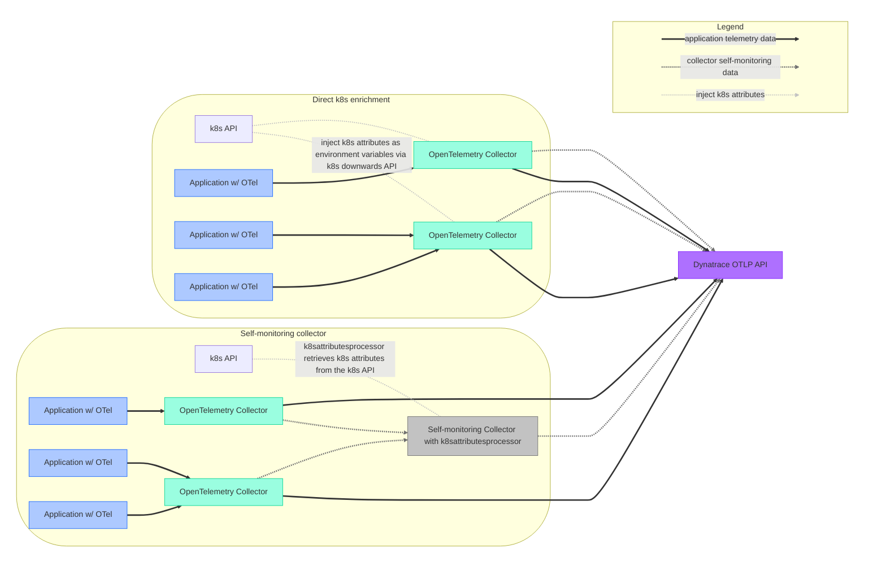
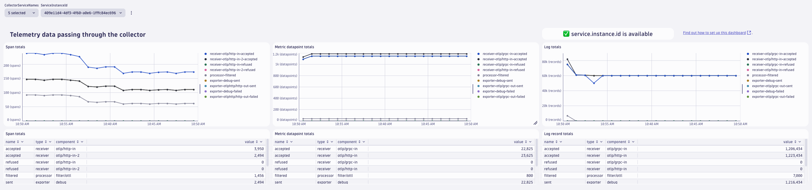
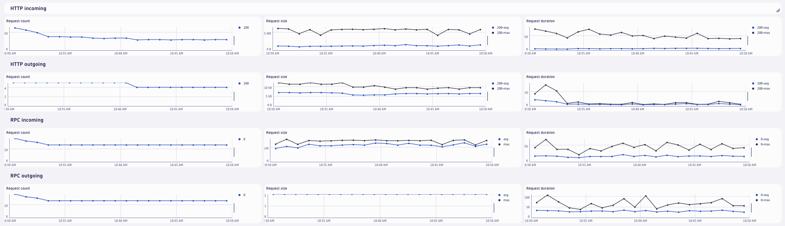
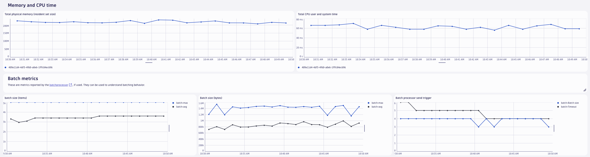

# OpenTelemetry collector self-monitoring dashboards

> [!WARNING]
> The dashboards shared in this repository are in an alpha state and can change significantly.
> They are provided as-is, with no support guarantees. 
> Newer versions of these dashboards could look significantly different from earlier versions and add or remove certain metrics.

This folder contains dashboards that can be used to monitor the health of deployed OpenTelemetry collectors. The dashboards are in JSON format and can be uploaded to your Dynatrace tenant by [following the steps in the Dynatrace documentation](https://docs.dynatrace.com/docs/observe-and-explore/dashboards-and-notebooks/dashboards-new/get-started/dashboards-manage#dashboards-upload).


There are two dashboards:
- [OTel Collector self-monitoring (all collectors)](./OTel%20Collector%20self-monitoring%20(all%20collectors).json) - shows an overview of all detected OpenTelemetry collectors
- [OTel Collector self-monitoring (single collector)](./OTel%20Collector%20self-monitoring%20(single%20collector).json) - allows to look at one specific collector instance. 

The dashboards rely on the presence of the `service.instance.id` resource attribute.
This attribute is added automatically by the collector to all exported telemetry.
However, it is not ingested into Dynatrace by default.
To find out how to add it, please see [Adding `service.instance.id` to the allow list](#adding-serviceinstanceid-to-the-allow-list)

The dashboards use metrics from the collectors' [internal telemetry](https://opentelemetry.io/docs/collector/internal-telemetry/).
See the [list of internal metrics](https://opentelemetry.io/docs/collector/internal-telemetry/#lists-of-internal-metrics) for an overview of which metrics are available.

## Prerequisites
The dashboards rely on the self-monitoring capabilities of the OTel collector as well as certain attributes on the exported metrics data.
Required attributes are: 
- `service.name` (automatically added by the collector and added to data ingested by Dynatrace)
- `service.instance.id` (automatically added by the collector, needs to be [added to the Dynatrace attribute allow list](#adding-serviceinstanceid-to-the-allow-list))

Dynatrace accepts metrics data with Delta temporality via OTLP/HTTP.
Collector and Collector Contrib versions 0.107.0 and above as well as Dynatrace collector versions 0.12.0 and above support exporting metrics data in that format.
Earlier versions ignore the `temporality_preference` flag and would, therefore, require additional processing (cumulative to delta conversion) before ingestion.
It is possible to do this conversion in a collector, but it would make the setup more complicated, so it is initially omitted in this document.

The dashboards only use metrics that have a `service.name` from this list: `dynatrace-otel-collector,otelcorecol,otelcontribcol,otelcol,otelcol-contrib`.
At the top of the dashboards, you can filter for specific `service.name`s.
You can also edit the variable and add service names if your collector has a different `service.name` and does not show up on the dash.

### Adding `service.instance.id` to the allow list
While `service.name` is on the Dynatrace OTLP metrics ingest allow list by default, `service.instance.id` is not.
To add it, follow [this guide](https://docs.dynatrace.com/docs/shortlink/metrics-configuration#allow-list) and add `service.instance.id` (case-sensitive) to the list.
This will ensure that this resource attribute is stored as a dimension on the metrics in Dynatrace.
The dashboard will indicate that `service.instance.id` is not set up correctly at the top of the dashboard:


## Sending internal telemetry (self-monitoring data) to Dynatrace
Every OpenTelemetry collector has self-monitoring capabilities, but they need to be activated.
Self-monitoring data can be exported from the collector via the OTLP protocol.
The configuration below assumes the environment variables `DT_ENDPOINT` and `DT_API_TOKEN` to be set.
In order to send data to Dynatrace via OTLP, you will need to supply a Dynatrace endpoint and an ingest token with the `metrics.ingest` scope set.
See the [Dynatrace docs](https://docs.dynatrace.com/docs/extend-dynatrace/opentelemetry/getting-started/otlp-export) for more information.
The `DT_ENDPOINT` environment variable should contain the base URL and the base `/api/v2/otlp` (e.g. `https://{your-environment-id}.live.dynatrace.com/api/v2/otlp`).

To send self-monitoring data to Dynatrace, use the following configuration:

```yaml
service:
  # turn on self-monitoring
  telemetry:
    metrics:
      # metrics verbosity level. Higher verbosity means more metrics. 
      # The dashboard relies on metrics at level detailed.
      level: detailed
      # set up OTLP exporter
      readers:
        - periodic:
            interval: 60000
            exporter:
              otlp:
                protocol: http/protobuf
                temporality_preference: delta
                endpoint: "${env:DT_ENDPOINT}/v1/metrics"
                headers:
                  - name: Authorization
                    value: "Api-Token ${env:DT_API_TOKEN}"
```

Note that the OTel collector can automatically merge configuration files for you, so by assuming the above configuration is stored in a file called `selfmon-config.yaml`, it is possible to start the collector like this:

```sh
./dynatrace-otel-collector --config=your-already-existing-config.yaml --config=selfmon-config.yaml
```

Of course, you can also add the configuration directly to your existing collector configuration.

## Enriching OTel collector self-monitoring data with Kubernetes attributes

Out of the box, the collector will add `service.instance.id` to all exported metrics.
This allows distinguishing between collector instances.
However, the `service.instance.id` is a randomly created UUID, and is therefore not very easy to interpret.
It is possible to enrich the exported data with more attributes, for examples Kubernetes attributes, that are more easily interpreted by humans.

There are two main ways of adding Kubernetes attributes to OTel collector telemetry data:
1. Routing all collector self-monitoring data through a "gateway" or "self-monitoring" collector, and using the `k8sattributesprocessor` to enrich that telemetry data.
2. Injecting the relevant attributes into the container environment, reading them in the collector, and adding them to the telemetry generated on the collector.



### Gateway collector

In this approach, collectors are configured to send their internal telemetry to one dedicated collector, which enriches the incoming telemetry with k8s attributes using the `k8sattributesprocessor`.
The `k8sattributesprocessor` retrieves this data from the k8s API, and attaches it to the telemetry passing through it.
One limitation of this approach is that the automatic enrichment will not work for the telemetry that that one collector instance (the "gateway" collector instance) exports itself.
[Learn how to set up the gateway collector with the k8sattributesprocessor in the Dynatrace docs](https://docs.dynatrace.com/docs/extend-dynatrace/opentelemetry/collector/use-cases/kubernetes/k8s-enrich#kubernetes).

### Read attributes from the container environment

The Kubernetes downwards API allows injecting information about the Kubernetes environment that a certain pod is running in.
Pod and container information can be exposed to the container via environment variables.
[The Kubernetes documentation](https://kubernetes.io/docs/tasks/inject-data-application/environment-variable-expose-pod-information/#use-pod-fields-as-values-for-environment-variables) explains how to specify data like the node name, namespace, or pod name as environment variables.
These variables are then available to be read from inside the container.
An example pod spec could be (values in `<>` are placeholders for your actual pod specifications, dependent on your setup):

```yaml
apiVersion: v1
kind: Pod
metadata:
  name: <your-pod-name>
spec:
  containers:
    - name: <your-container>
      image: <your-image>
      env:
        - name: MY_NODE_NAME
          valueFrom:
            fieldRef:
              fieldPath: spec.nodeName
        - name: MY_POD_NAME
          valueFrom:
            fieldRef:
              fieldPath: metadata.name
        - name: MY_POD_NAMESPACE
          valueFrom:
            fieldRef:
              fieldPath: metadata.namespace
```

The OTel collector configuration for self-monitoring data allows adding attributes based on environment variables.
The configuration below assumes that you injected the environment variables `MY_NODE_NAME`, `MY_POD_NAME`, and `MY_POD_NAMESPACE` into your OTel collector container, and adds the attributes on the exported telemetry.
No extra collector is required to enrich in-flight telemetry.

```yaml
service:
  telemetry:
    resource:
      # This section reads the previously injected environment variables 
      # and attaches them to the telemetry the collector generates about itself.
      k8s.namespace.name: "${env:MY_POD_NAMESPACE}"
      k8s.pod.name: "${env:MY_POD_NAME}"
      k8s.node.name: "${env:MY_NODE_NAME}"

    # the rest of the configuration did not change compared to above.
    metrics:
      level: detailed
      readers:
        - periodic:
            exporter:
              otlp:
                endpoint: <...>
```

## More screenshots

### Dashboard containing all collectors


### Single-collector dashboard



